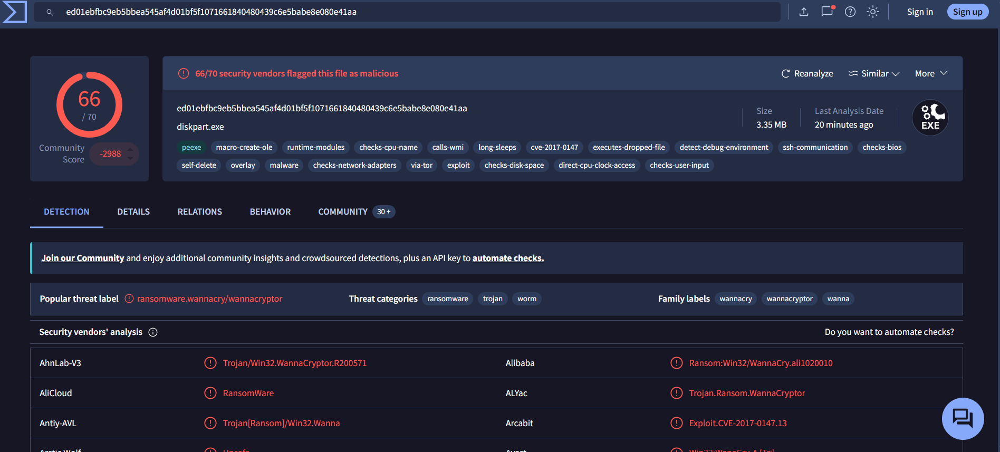
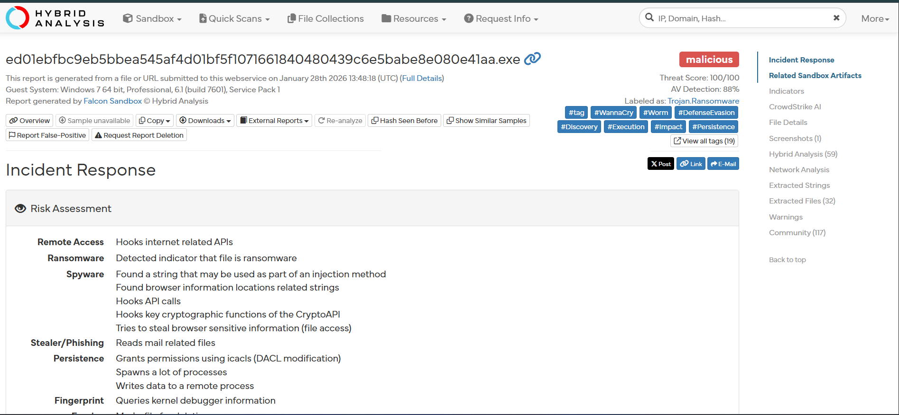
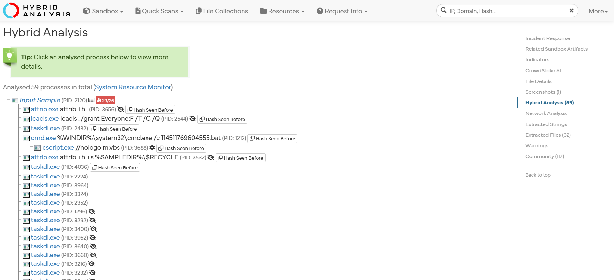
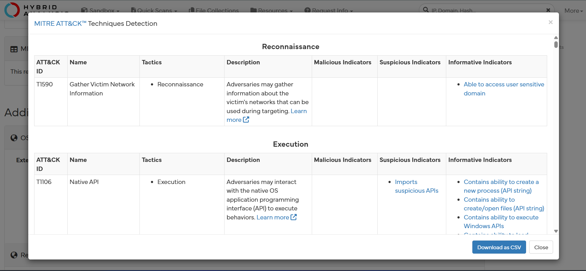

# Malware Analysis — Static Analysis of WannaCry Sample

**Status:** ✅ Complete
**Environment:** REMnux (Linux malware analysis distro)

## Objective
Perform static analysis on a WannaCry ransomware sample to identify its 
file type, embedded artifacts, and threat classification without 
executing the malware.

## Tools Used
- `file` — identify true file type via signature
- `strings` — extract readable text from the binary
- `md5sum` — generate file hash
- `pecheck` — analyze PE header structure, section entropy, and imported functions
- VirusTotal — cross-reference hash against 70 AV vendor detections
- Hybrid Analysis — reviewed pre-existing sandbox detonation report via hash lookup

## Methodology

1. **File identification** — Ran `file wannacry` to confirm the true 
   file type independent of name/extension. Result: `PE32 executable 
   (GUI) Intel 80386, for MS Windows` — confirming a 32-bit Windows 
   binary with a GUI subsystem, consistent with WannaCry's known 
   ransom-note display behavior.

2. **String extraction** — Ran `strings wannacry` to extract embedded 
   readable text without executing the file, reviewing for file paths, 
   library references, and other behavioral clues.

3. **File hashing** — Calculated the file's MD5 hash to generate a 
   unique fingerprint for safe identification and threat intel lookup:
   `84c82835a5d21bbcf75a61706d8ab549`

4. **Threat intelligence lookup** — Searched the hash on VirusTotal 
   rather than uploading the file directly, to avoid exposing a live 
   malware sample. Reviewed vendor detections, threat classification, 
   and file metadata.

5. **PE header analysis** — Used `pecheck` to inspect the PE header 
   structure, section entropy, and imported functions (DLL dependencies) 
   to understand the sample's capabilities without executing it.

6. **Dynamic analysis (sandbox report review)** — Rather than executing 
   the live sample directly, searched the file's MD5 hash on Hybrid 
   Analysis (an online sandbox service) to review a pre-existing 
   detonation report, avoiding the risk of running live ransomware 
   outside a purpose-built isolated lab.

## Key Findings
- File confirmed as a 32-bit Windows PE executable with a GUI subsystem
- MD5 hash: `84c82835a5d21bbcf75a61706d8ab549`
- SHA256 hash: `ed01ebfbc9eb5bbea545af4d01bf5f1071661840480439c6e5babe8e080e41aa`
- VirusTotal detection: **66/70 security vendors flagged the file as malicious**
- Popular threat label: `ransomware.wannacry/wannacryptor`
- Threat categories: ransomware, trojan, worm
- Family labels: wannacry, wannacryptor, wanna
- Sample was disguised under the filename **diskpart.exe** — the name of a 
  legitimate Windows disk-partitioning utility, indicating a filename-spoofing 
  technique used to blend in with trusted system tools
- `.rsrc` section entropy measured 7.99 (near-maximum randomness), 
  indicating likely packed or encrypted data embedded in the resources 
  section
- Imported functions from `ADVAPI32.dll` reveal Windows service 
  creation/control capabilities (`CreateServiceA`, `StartServiceA`, 
  `OpenSCManagerA`) and cryptographic API usage (`CryptReleaseContext`), 
  consistent with ransomware behavior — installing itself as a 
  persistent service and using encryption routines
- Registry manipulation functions imported (`RegCreateKeyW`, 
  `RegSetValueExA`), suggesting the sample writes configuration or 
  persistence data to the Windows Registry

## Dynamic Analysis Findings

**Sandbox verdict:** Malicious — Threat Score 100/100, AV Detection 88%, 
labeled `Trojan.Ransomware` (analyzed on Windows 7 64-bit)

**Behavioral risk categories identified:**
- Remote Access — hooks internet-related APIs
- Ransomware — explicit ransomware indicator detected
- Spyware — hooks CryptoAPI cryptographic functions, contains 
  code-injection-related strings, attempts to access browser-stored 
  sensitive information
- Stealer/Phishing — reads mail-related files
- Persistence — modifies file permissions via `icacls` (DACL 
  modification), spawns a large number of child processes, writes data 
  to a remote process
- Anti-analysis — queries kernel debugger information, a common 
  technique to detect if it's being analyzed/debugged

**Process behavior (59 total processes observed):**
- `icacls . /grant Everyone:F /T /C /Q` — recursively grants full 
  file-system permissions to all users, ensuring the ransomware can 
  access and encrypt files regardless of original permissions
- Multiple `taskdl.exe` instances — matches WannaCry's known component 
  for cleaning up temporary files post-encryption
- `cmd.exe` executing a `.bat` script, which in turn triggers 
  `cscript.exe //nologo m.vbs` — a silently-run VBScript, avoiding any 
  visible window that might alert the user
- `attrib.exe attrib +h +s` applied to a file inside the Recycle Bin — 
  hides and flags it as a protected system file, consistent with 
  WannaCry's technique of concealing its decryption tool/ransom note

**MITRE ATT&CK techniques identified:**
- `T1590` — Gather Victim Network Information (Reconnaissance)
- `T1106` — Native API (Execution)

**Limitation:** Network traffic analysis was unavailable in this 
particular sandbox report.

## Screenshots

## Lessons Learned
Static analysis and hash-based threat intel lookups provide a safe, 
fast first pass at identifying an unknown sample before deeper dynamic 
analysis. Verifying true file type — rather than trusting the filename 
— is a critical first triage step, since attackers routinely rename or 
disguise malicious files. PE header analysis, particularly section 
entropy and imported functions, revealed strong behavioral indicators 
(service creation, cryptographic API usage, registry writes) even 
without running the sample — reinforcing how much can be learned about 
malware capability through static inspection alone. This investigation 
also highlighted how threat actors abuse trusted system tool names 
(e.g. diskpart.exe) to evade casual detection. Reviewing a sandbox 
report via hash lookup rather than executing the sample directly also 
demonstrated how analysts can safely gather dynamic behavioral 
intelligence — process activity, persistence mechanisms, and MITRE 
ATT&CK technique mapping — without the risk of running live malware 
outside a dedicated isolated environment.
