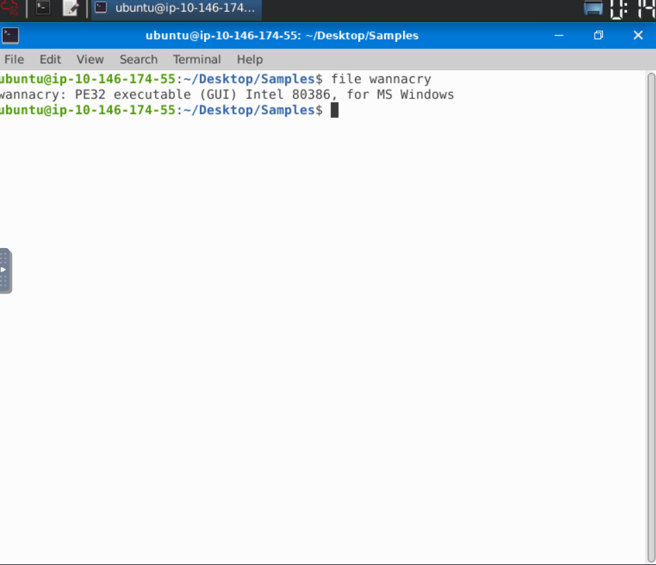
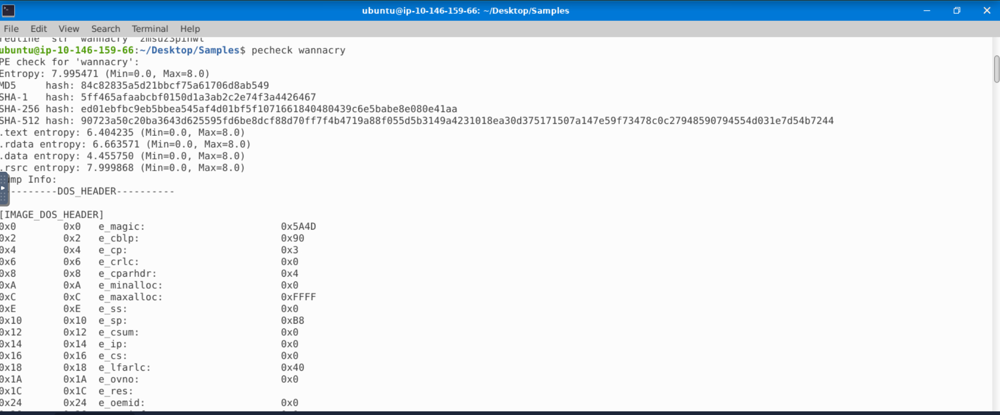
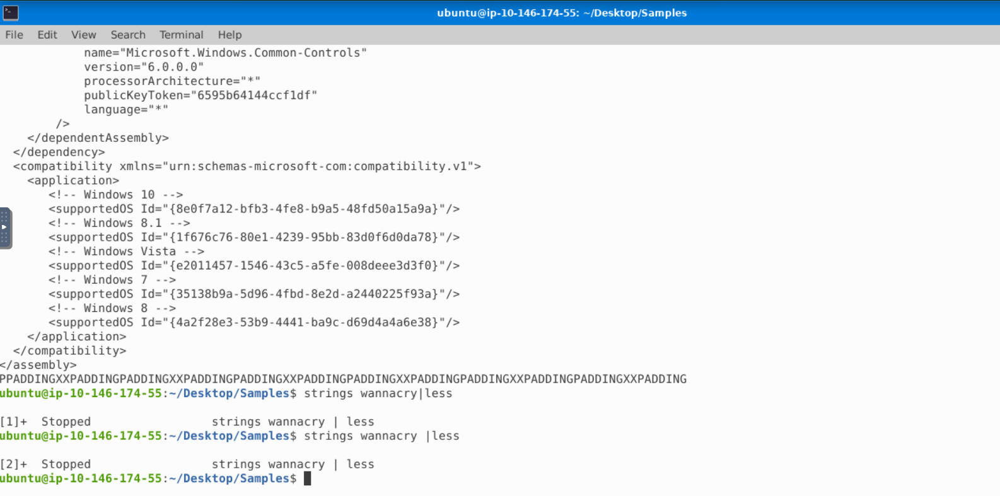

# Malware Analysis — Static Analysis of WannaCry Sample

**Status:** ✅ Complete
**Environment:** REMnux (Linux malware analysis distro)

## Objective
Perform static analysis on a WannaCry ransomware sample to identify its 
file type, embedded artifacts, and threat classification without 
executing the malware.

## Tools Used
- `file` — identify true file type via signature
- `strings` — extract readable text from the binary
- `md5sum` — generate file hash
- VirusTotal — cross-reference hash against 70 AV vendor detections

## Methodology

1. **File identification** — Ran `file wannacry` to confirm the true 
   file type independent of name/extension. Result: `PE32 executable 
   (GUI) Intel 80386, for MS Windows` — confirming a 32-bit Windows 
   binary with a GUI subsystem, consistent with WannaCry's known 
   ransom-note display behavior.

2. **String extraction** — Ran `strings wannacry` to extract embedded 
   readable text without executing the file, reviewing for file paths, 
   library references, and other behavioral clues.

3. **File hashing** — Calculated the file's MD5 hash to generate a 
   unique fingerprint for safe identification and threat intel lookup:
   `84c82835a5d21bbcf75a61706d8ab549`

4. **Threat intelligence lookup** — Searched the hash on VirusTotal 
   rather than uploading the file directly, to avoid exposing a live 
   malware sample. Reviewed vendor detections, threat classification, 
   and file metadata.

## Key Findings
- File confirmed as a 32-bit Windows PE executable with a GUI subsystem
- MD5 hash: `84c82835a5d21bbcf75a61706d8ab549`
- SHA256 hash: `ed01ebfbc9eb5bbea545af4d01bf5f1071661840480439c6e5babe8e080e41aa`
- VirusTotal detection: **66/70 security vendors flagged the file as malicious**
- Popular threat label: `ransomware.wannacry/wannacryptor`
- Threat categories: ransomware, trojan, worm
- Family labels: wannacry, wannacryptor, wanna
- Sample was disguised under the filename **diskpart.exe** — the name of a 
  legitimate Windows disk-partitioning utility, indicating a filename-spoofing 
  technique used to blend in with trusted system tools

## Screenshots

## Lessons Learned
Static analysis and hash-based threat intel lookups provide a safe, 
fast first pass at identifying an unknown sample before deeper dynamic 
analysis. Verifying true file type — rather than trusting the filename 
— is a critical first triage step, since attackers routinely rename or 
disguise malicious files. This investigation also reinforced how 
threat actors abuse trusted system tool names (e.g. diskpart.exe) to 
evade casual detection.
